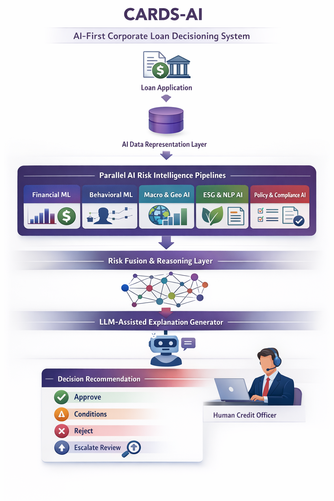
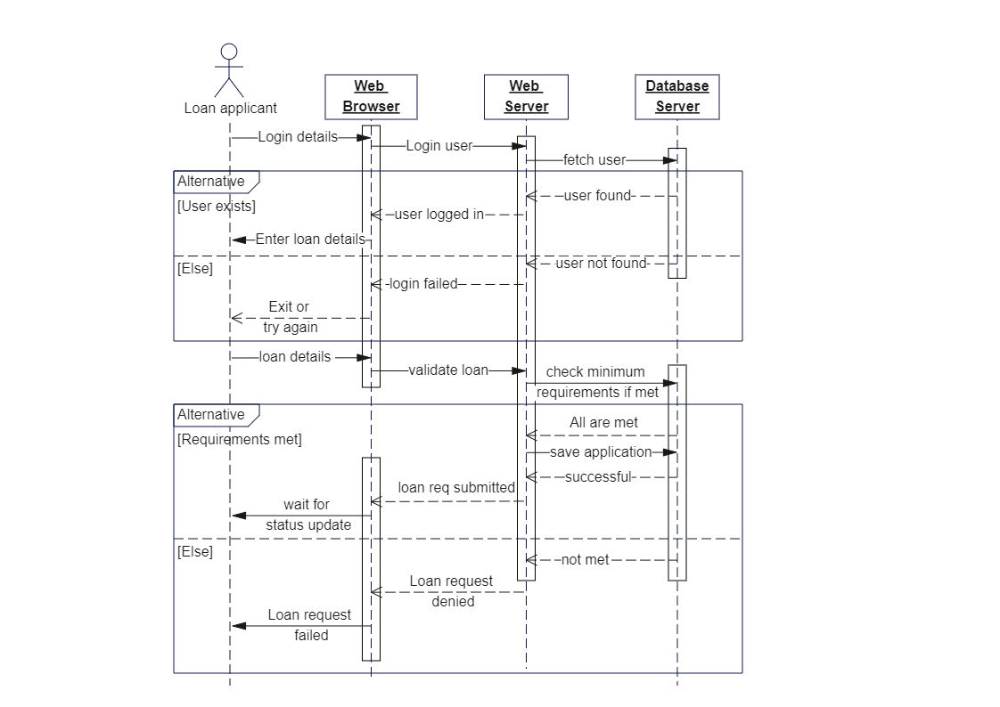

# Corporate-loan-decisioning
Corporate loan decisioning system using ML + LLMs with explainable risk intelligence
# CARDS-AI (Corporate AI Risk & Decisioning System)
## A Corporate Loan Decisioning System  

**Multi-Model Risk Intelligence · LLM-Assisted Reasoning · Explainable Decisions**

---

## 1. What This System Is

CARDS-AI is an **AI-first decision intelligence system** that assists corporate banks in evaluating corporate loan applications.

The system treats loan approval as a **machine-assisted reasoning problem**, not a binary classification task.  
Multiple AI models analyze different risk dimensions in parallel, and their outputs are fused into a transparent, confidence-aware recommendation reviewed by a human credit officer.

This project focuses on **AI system design**, not application development.

---

## 2. Why Traditional ML Is Not Enough

A single ML model cannot:

- Reason across heterogeneous data types  
- Adapt to macroeconomic regime shifts  
- Explain decisions to regulators  
- Handle uncertainty and conflicting signals  

CARDS-AI addresses these limitations by using:

- Multiple specialized ML models  
- Scenario-aware risk weighting  
- Generative AI for structured reasoning  
- Explicit uncertainty handling  

---

## 3. AI System Overview

              Loan Application
                      │
                      ▼
              AI Data Representation Layer
                      │
                      ▼
       ┌───────────────────────────────────────────────┐
       │ Parallel AI Risk Intelligence Pipelines       │
       └───────────────────────────────────────────────┘
         │           │           │           │       │
         ▼           ▼           ▼           ▼       ▼
       Financial  Behavioral  Macro-Geo   ESG-NLP  Policy
         ML         ML         AI          AI        AI
         ─────────────────────────────────────────────────
                        │
                        ▼
       AI Risk Fusion & Reasoning Layer
                        │
                        ▼
       LLM-Assisted Explanation Generator
                        │
                        ▼
       Decision Recommendation + Confidence

---

---
## 4. AI Risk Intelligence Pipelines

Each pipeline produces an **independent probabilistic risk signal**.

---

### 4.1 Financial Risk ML

**AI Objective**  
Estimate repayment risk under normal and stressed conditions.

**ML Techniques**
- Gradient Boosted Trees  
- Logistic Regression (baseline)  
- Scenario-based stress testing  

**Outputs**
- Probability of default  
- Financial risk score  
- Feature-level importance  

---

### 4.2 Behavioral & Temporal ML

**AI Objective**  
Model borrower behavior over time.

**ML Techniques**
- Time-series anomaly detection  
- Trend stability analysis  
- Relationship scoring  

**Outputs**
- Behavioral risk classification  
- Stability confidence  

---

### 4.3 Macro-Economic & Geopolitical AI

**AI Objective**  
Quantify how external shocks affect borrower risk.

**AI Techniques**
- Scenario simulation  
- Country risk embeddings  
- Sector cyclicality modeling  

**Outputs**
- Macro stress impact score  
- Scenario sensitivity summary  

---

### 4.4 ESG & Reputation AI (LLM-Assisted)

**AI Objective**  
Extract non-financial risk from unstructured text.

**AI Techniques**
- NLP document parsing  
- Embedding-based retrieval  
- LLM-assisted summarization  

**Outputs**
- ESG risk category  
- Governance and reputational signals  

---

### 4.5 Policy & Compliance AI

**AI Objective**  
Enforce hard constraints and detect violations.

**AI Techniques**
- Rule-based reasoning  
- Constraint validation  
- Conflict detection  

**Outputs**
- Policy pass/fail signals  
- Escalation flags  

---

## 5. AI Risk Fusion & Reasoning

This is the **core intelligence layer**.

The system:

- Aggregates risk signals  
- Applies context-aware weighting  
- Accounts for model confidence  
- Detects disagreement between models  

**Result**
- Composite risk score  
- Confidence interval  
- Primary risk contributors  

This avoids over-reliance on any single model.

---

## 6. Decision Intelligence Output

CARDS-AI produces one of four recommendations:

- **Approve**  
- **Approve with conditions**  
- **Reject**  
- **Escalate for manual review**  

Each recommendation includes:

- Composite risk scores  
- Model confidence  
- Natural-language explanation  
- Policy references  
- Counterfactual guidance (what would change the outcome)  

---

## 7. Role of Generative AI

Generative AI is used **only for reasoning and explanation**, not for decision authority.

LLMs are responsible for:
- Translating model outputs into explanations  
- Summarizing unstructured risk signals  
- Drafting analyst-readable credit narratives  

LLMs do **not**:
- Predict risk  
- Approve loans  
- Override policy constraints  

This preserves determinism and trust.

---

## 8. Human-in-the-Loop AI Design

The system explicitly supports:

- Analyst review of model reasoning  
- Follow-up queries to the AI  
- Manual overrides with justification  

Human judgment remains the final authority.

---

## 9. What Makes This AI-Centric

- Multi-model ensemble intelligence  
- Explicit uncertainty handling  
- LLM-assisted reasoning layers  
- Counterfactual explanations  
- Clear separation of prediction vs reasoning  

This is **AI system engineering**, not a single model demo.

---

## 10. Future AI Enhancements

- Autonomous multi-agent risk analysis  
- Continual learning from portfolio outcomes  
- Climate-risk simulation models  
- Portfolio-level optimization agents  

---

The above design shows how AI can be structured as a **reasoning system** that supports high-stakes decisions while remaining transparent, controllable, and explainable.

---
## Sequence Diagram

